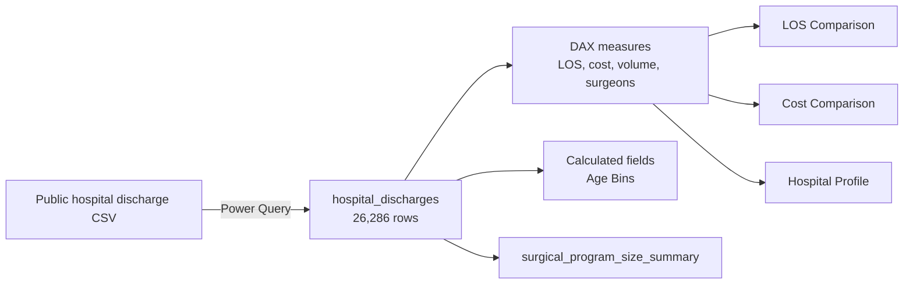

# HealthStat — Healthcare Analysis in Power BI

[](https://powerbi.microsoft.com/)


An interactive Power BI report that compares **elective hip-replacement inpatient stays across New York State hospitals in 2016**. The analysis connects procedure volume, surgeon capacity, length of stay (LOS), cost, patient severity, mortality risk, diagnosis, and discharge disposition to support hospital-level benchmarking.


## At a glance

| Metric | Result |
|---|---:|
| Inpatient discharges | **26,286** |
| Hospitals | **151** |
| Operating surgeons | **627** |
| Average length of stay | **2.65 days** |
| Average cost per discharge | **$20,910** |
| Reporting period | **2016** |

## Business questions

- Which hospitals handle the largest hip-replacement volumes?
- How does average length of stay vary across hospitals and health-service areas?
- Which hospitals have the highest and lowest average cost per discharge?
- Is a longer hospital stay associated with a higher average discharge cost?
- Which patient and program characteristics help explain differences in LOS and cost?
- How does an individual hospital compare with statewide benchmarks?

## Report pages

The PBIX contains four report pages and 30 interactive visuals.

| Page | Purpose | Key visuals and interactions |
|---|---|---|
| **Home** | Introduces the HealthStat report and provides navigation. | Page navigator for direct access to the analysis views. |
| **LOS Comparison** | Benchmarks inpatient length of stay and procedure volume. | KPI cards, health-service-area slicer, Top 15 hospital combo chart, highest/lowest LOS rankings, and a Key Influencers visual. |
| **Cost Comparison** | Examines variation in average cost per discharge. | KPI cards, cost-versus-LOS scatter plot, highest/lowest cost rankings, health-service-area slicer, and Key Influencers analysis. |
| **Hospital Profile** | Provides a focused view of one selected hospital. | Facility slicer, LOS and cost gauges against statewide averages, severity and mortality-risk columns, and diagnosis/disposition donut charts. |


> The visuals above were generated from the semantic model embedded in the project PBIX. Bubble size represents discharge volume; dashed lines show the statewide average.

## Key findings

- **Volume is concentrated at a small number of hospitals.** Hospital for Special Surgery recorded **4,515 discharges (17.2%)**, while NYU Hospital for Joint Diseases recorded **1,761 (6.7%)**. Together, they represent almost one quarter of all records.
- **Patients aged 50 and older dominate the dataset.** The calculated `Age Bins` field places **23,861 discharges (90.8%)** in the Age 50+ category.
- **New York City is the largest service area.** It accounts for **9,975 discharges (38.0%)**, followed by Long Island with 3,428.
- **LOS and cost move together, but not perfectly.** At the hospital level, average LOS and average cost per discharge have a **moderate positive correlation of 0.41**. Longer stays are generally associated with higher cost, while other hospital and patient factors still matter.
- **Extreme rankings need volume context.** Kings County Hospital Center has the highest average LOS at **12.0 days**, but this is based on only **19 discharges**. The dashboard therefore pairs averages with volume instead of treating rankings alone as performance conclusions.

These findings describe patterns in the supplied dataset; they do not establish causes or measure quality of care.

## Data and preparation

The report imports a public CSV of hospital inpatient discharges and filters it to `HIP REPLACEMENT,TOT/PRT`. The final fact table contains 31 analysis fields covering:

- hospital and health-service-area identifiers;
- age, gender, race, and ethnicity;
- length of stay and admission/discharge details;
- diagnosis, procedure, severity, and mortality-risk classifications;
- attending and operating provider identifiers; and
- total charges and total costs.

Power Query performs the core ingestion and preparation steps:

1. Connect to the CSV with `Web.Contents()`.
2. Promote the first row to column headers.
3. Assign appropriate text, whole-number, and decimal data types.
4. Filter the procedure description to total/partial hip replacement.
5. Load the cleaned data into the Power BI semantic model.

The report source is the [DataCamp-hosted hospital inpatient discharge dataset](https://assets.datacamp.com/production/repositories/6258/datasets/f5df95d11522455215a579dc5baeb0d57dd30caa/hospital_inpatient_discharges_totalhipreplacement.csv).

## Semantic model



The model uses one main fact table, a dedicated `_Measures` table, and a calculated hospital summary table. It contains **10 explicit measures**, including statewide benchmark measures used by the Hospital Profile gauges.

## DAX examples

### Average cost per discharge

```DAX
Average Cost per Discharge =
DIVIDE(
    SUM(hospital_discharges[total_costs]),
    [Total Discharges]
)
```

### Variance from the statewide average

```DAX
% Var Average LOS Days =
VAR vAVG = [Average LOS Days]
VAR vAvgALL = CALCULATE([Average LOS Days], ALL())
RETURN
    DIVIDE(vAVG - vAvgALL, vAvgALL)
```

### Hospital-level summary table

```DAX
surgical_program_size_summary =
SUMMARIZECOLUMNS(
    hospital_discharges[facility_name],
    "Total Discharges", [Total Discharges],
    "Total Surgeons", [Total Surgeons]
)
```

### Patient age bands

```DAX
Age Bins =
IF(
    OR(
        hospital_discharges[age_group] = "50 to 69",
        hospital_discharges[age_group] = "70 or Older"
    ),
    "Age 50+",
    "Age <50"
)
```

## Skills demonstrated

- Power Query ingestion, filtering, and type management
- Dimensional thinking and semantic-model organization
- DAX measures, variables, filter context, and calculated tables
- KPI design and statewide benchmark comparisons
- Combo, scatter, ranking, gauge, donut, and Key Influencers visuals
- Slicers, dynamic titles, navigation, and hospital drill-down analysis
- Data storytelling with appropriate volume and interpretation caveats

## Repository structure

```text
Healthcare-Analysis-in-PowerBI/
├── Healthcare Analysis PBI.pbix
├── README.md
└── assets/
    ├── cost-comparison.svg
    └── los-comparison.svg
```

## How to explore the report

1. Download [`Healthcare Analysis PBI.pbix`](Healthcare%20Analysis%20PBI.pbix).
2. Open the file in Power BI Desktop.
3. Use the page navigator to move among LOS Comparison, Cost Comparison, and Hospital Profile.
4. Filter the comparison pages by health-service area.
5. Select a hospital on the Hospital Profile page to compare it with statewide LOS and cost benchmarks.

## Limitations

- The analysis covers a single year (2016) and one procedure group, so it should not be generalized to all hospital activity.
- Results are descriptive and do not control for differences in patient mix or clinical complexity.
- Hospital averages based on small discharge counts can be unstable and should be interpreted alongside volume.
- Provider counts are distinct identifiers in the dataset and may not represent current staffing.

## Author

**Obay Baradie**  
Economics and Management Science graduate with training in data analytics, predictive analytics, and business intelligence.

---

*This project is for educational and portfolio purposes. It is not medical advice and should not be used as the sole basis for clinical or operational decisions.*
